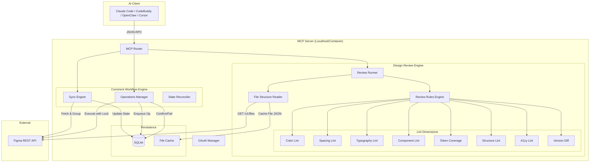

# Figma Design Pilot (MCP Server Edition)
## 产品需求文档 (PRD) V4.0

**文档状态**: DRAFT
**版本**: 4.0
**日期**: 2026-02-10
**架构决策**: Stateful MCP Server (基于本地 SQLite + Outbox 模式)
**修订摘要**: 从"Comment Pilot"升级为"Design Pilot"——新增 **Design Review（设计评审引擎）** 模块，类比 Git Code Review，提供设计规范自动检查、Token 覆盖率分析、组件健康度审计等 AI Agent 驱动的设计质量保障能力。

---

## 1. 产品概述 (Product Overview)

### 1.1 名称与定义
**产品名称**: Figma Design Pilot MCP
**定义**: 一个符合 Model Context Protocol (MCP) 标准的有状态服务端应用。作为 AI Agent 与 Figma 文件之间的**设计智能网关**，提供两大核心能力：

1. **Design Review（设计评审）** — 类比 Git Code Review，AI Agent 可自动分析设计文件，从颜色规范、间距网格、排版系统、组件使用、Token 覆盖率、图层结构、可访问性等维度进行全面审查，并将问题以评论形式内联标注在设计稿中。
2. **Comment Workflow（评论工作流）** — 将 Figma 原始的扁平评论流转换为以**线程 (Thread)** 为单位的结构化工作流，支持 AI 驱动的自动回复、状态管理和协作追踪。

### 1.2 核心价值
*   **Design Review as Code Review**: 让设计稿也能像代码一样经历系统化的质量评审，AI Agent 自动发现硬编码颜色、Detach 组件、未绑定变量等规范违规，并以评论形式精准标注。
*   **Token-First 理念**: 将 Design Token 覆盖率作为核心指标，推动设计师从"看着差不多就行"进化到"所有值必须来自变量系统"。
*   **以线程为中心 (Thread-Centric)**: 将"零散评论"聚合为"会话线程"，提供完整的上下文（根评论+回复+状态）。
*   **强一致性与幂等性 (Idempotency)**: 引入 `operations` 出站箱 (Outbox) 模式，确保在网络抖动或崩溃重启后，AI 的操作不丢失、不重复。
*   **通用协议标准**: 通过 MCP 协议，一次部署，同时服务于 Claude Code、CodeBuddy、OpenClaw、Cursor 等 Agent。

### 1.3 类比：Code Review vs Design Review

| Code Review (Git) | Design Review (Figma Design Pilot) |
|:---|:---|
| ESLint / Linter | **Design Lint** — 硬编码值、规范违规自动检查 |
| TypeScript Type Check | **Token Check** — 所有属性是否绑定变量/样式 |
| `npm audit` / Dependency Audit | **Component Audit** — 组件引用健康度、Detach 检测 |
| Code Coverage | **Design System Coverage** — Token 覆盖率 |
| `git diff` / PR Diff | **Version Diff** — 版本间设计变更对比 |
| PR Review Comments | **Comment Workflow** — 评审意见内联标注 ✅ |
| CI Pipeline | **Review Pipeline** — Agent 自动化评审流水线 |

---

## 2. 问题定义 (Problem Definition)

### 2.1 评论工作流痛点（已在 V3.1 解决）

| 痛点 | 描述 | 影响 |
| :--- | :--- | :--- |
| **API 返回扁平化** | Figma API 返回无序评论列表，缺乏对话结构。 | AI 难以理解上下文。 |
| **缺乏原子性操作** | 网络超时可能导致重复回复。 | 干扰设计师工作。 |
| **状态缺失** | Figma 仅有"Resolve"，API 不支持筛选。 | Token 浪费严重。 |
| **自身回复死循环** | AI 可能对自己生成的回复再次回复。 | "Bot vs Bot"风暴。 |

### 2.2 设计评审痛点（V4.0 新增解决）

| 痛点 | 描述 | 影响 |
| :--- | :--- | :--- |
| **硬编码泛滥** | 设计师直接输入颜色值(#FF0000)、间距(13px)，不使用变量/样式。 | 设计系统形同虚设，主题切换/批量修改困难。 |
| **组件 Detach 失控** | 设计师为图省事 Detach 组件后自行修改，脱离设计系统管控。 | 设计一致性崩溃，开发无法复用组件代码。 |
| **评审全靠肉眼** | 设计 Lead 逐页检查设计稿，效率极低且容易遗漏。 | 评审成本高，质量不稳定。 |
| **Token 同步断裂** | 代码中的 Token 与 Figma 变量无法自动对比验证。 | 设计-开发双源不一致。 |
| **可访问性被忽视** | 对比度、触控目标大小等 A11y 问题通常到开发阶段才发现。 | 返工成本高。 |
| **版本变更不透明** | 设计文件的修改缺少系统化的变更追踪和 diff 能力。 | 不知道"谁改了什么"。 |

---

## 3. 产品目标与成功指标 (Goals & Metrics)

### 3.1 Comment Workflow 指标（保留）
*   **同步准确率 (Recall)**: 100%
*   **操作幂等率**: 100%
*   **状态识别准确率**: > 99%
*   **响应延迟**: 增量同步 < 3 秒 (1000 条评论规模)

### 3.2 Design Review 指标（新增）
*   **检查维度覆盖**: 8 大维度全部可检查
*   **Token 覆盖率可量化**: 精确到属性级别的绑定统计
*   **单页评审耗时**: < 10 秒 (100 个节点规模)
*   **误报率**: < 5%（通过可配置的规则白名单减少噪音）
*   **检查结果可操作**: 每个问题附带具体的修复建议和定位

---

## 4. 系统架构 (System Architecture)

### 4.1 架构图


### 4.2 核心设计模式
1. **Design Review Engine**: 拉取文件 JSON → 缓存 → 遍历节点树 → 多维度 Lint 规则引擎 → 聚合报告
2. **Unit of Work = Thread**: 评论工作流以"根评论及其子回复"作为整体单元处理
3. **Outbox Pattern (出站箱模式)**: 所有写操作先入队 → 异步执行 → 确认/重试
4. **Single Writer Lock**: 同一 `file_key` 同时只能有一个 Sync 或 Write 操作
5. **Review → Comment 联动**: 评审发现的问题可自动生成 Figma 评论，实现 Design Review 的闭环

---

## 5. 数据模型 (Data Model)

### 5.1 SQLite Schema

```sql
-- ═══════════════════════════════════════════════════════════
-- Comment Workflow Tables (from V3.1)
-- ═══════════════════════════════════════════════════════════

-- 1. 评论表 (核心数据)
CREATE TABLE IF NOT EXISTS comments (
    id TEXT PRIMARY KEY,
    file_key TEXT NOT NULL,
    parent_id TEXT,
    root_id TEXT,
    is_root BOOLEAN GENERATED ALWAYS AS (parent_id IS NULL) STORED,
    
    message_text TEXT NOT NULL,
    author_id TEXT NOT NULL,
    author_handle TEXT,
    created_at DATETIME NOT NULL,
    updated_at DATETIME,
    deleted_at DATETIME,
    
    reactions_json TEXT,
    
    remote_status_emoji TEXT,
    local_status TEXT DEFAULT 'OPEN',
    reply_posted_by_ai BOOLEAN DEFAULT 0,
    
    INDEX idx_file_root (file_key, root_id),
    INDEX idx_status (local_status)
);

-- 2. 操作出站箱 (幂等与重试)
CREATE TABLE IF NOT EXISTS operations (
    op_id TEXT PRIMARY KEY,
    idempotency_key TEXT NOT NULL,
    file_key TEXT NOT NULL,
    
    op_type TEXT NOT NULL,              -- 'REPLY', 'ADD_REACTION', 'REMOVE_REACTION'
    payload_json TEXT NOT NULL,
    
    state TEXT DEFAULT 'PENDING',       -- PENDING, PROCESSING, CONFIRMED, FAILED
    retry_count INTEGER DEFAULT 0,
    error_message TEXT,
    
    created_at DATETIME DEFAULT CURRENT_TIMESTAMP,
    updated_at DATETIME DEFAULT CURRENT_TIMESTAMP,
    
    UNIQUE(idempotency_key)
);

-- 3. 同步状态 (断点续传)
CREATE TABLE IF NOT EXISTS sync_state (
    file_key TEXT PRIMARY KEY,
    last_full_sync_at DATETIME,
    last_event_id TEXT,
    bot_user_id TEXT,
    sync_config_json TEXT
);

-- 4. 全局配置 (Token)
CREATE TABLE IF NOT EXISTS config (
    key TEXT PRIMARY KEY,
    value TEXT
);

-- ═══════════════════════════════════════════════════════════
-- Design Review Tables (V4.0 新增)
-- ═══════════════════════════════════════════════════════════

-- 5. 文件快照缓存 (避免重复拉取大文件)
CREATE TABLE IF NOT EXISTS file_snapshots (
    file_key TEXT NOT NULL,
    version_id TEXT NOT NULL,           -- Figma version hash
    fetched_at DATETIME DEFAULT CURRENT_TIMESTAMP,
    file_json_gz BLOB NOT NULL,         -- gzip 压缩的文件 JSON
    node_count INTEGER,                 -- 节点总数统计
    PRIMARY KEY (file_key, version_id)
);

-- 6. 评审报告 (历史可追溯)
CREATE TABLE IF NOT EXISTS review_reports (
    report_id TEXT PRIMARY KEY,
    file_key TEXT NOT NULL,
    version_id TEXT,
    page_name TEXT,                     -- 被评审的页面名称 (NULL=全文件)
    
    created_at DATETIME DEFAULT CURRENT_TIMESTAMP,
    
    -- 聚合统计
    total_nodes INTEGER,
    total_issues INTEGER,
    error_count INTEGER,
    warning_count INTEGER,
    info_count INTEGER,
    
    -- 按维度统计 (JSON)
    dimension_summary_json TEXT,        -- {"colors": {errors: 3, warnings: 1}, ...}
    
    -- Token 覆盖率
    token_coverage_percent REAL,
    token_bound_count INTEGER,
    token_total_count INTEGER,
    
    -- 整体评分
    score REAL,                         -- 0-100 综合得分
    grade TEXT,                         -- A/B/C/D/F
    
    INDEX idx_file_report (file_key, created_at)
);

-- 7. 评审问题明细 (单条问题)
CREATE TABLE IF NOT EXISTS review_issues (
    issue_id TEXT PRIMARY KEY,
    report_id TEXT NOT NULL REFERENCES review_reports(report_id),
    
    dimension TEXT NOT NULL,            -- 'color', 'spacing', 'typography', 'component', 'token', 'structure', 'a11y'
    severity TEXT NOT NULL,             -- 'error', 'warning', 'info'
    rule_id TEXT NOT NULL,              -- e.g. 'color/hardcoded-fill', 'component/detached'
    
    node_id TEXT,                       -- Figma node ID
    node_name TEXT,
    node_type TEXT,                     -- 'FRAME', 'TEXT', 'RECTANGLE', ...
    page_name TEXT,
    
    message TEXT NOT NULL,              -- 人类可读的问题描述
    suggestion TEXT,                    -- 修复建议
    
    -- 问题详情 (JSON, 不同维度结构不同)
    detail_json TEXT,                   -- e.g. {"property": "fill", "value": "#FF0000", "suggestedVariable": "color/error"}
    
    -- 状态
    status TEXT DEFAULT 'OPEN',         -- OPEN, ACKNOWLEDGED, FIXED, WONTFIX
    comment_id TEXT,                    -- 关联的 Figma 评论 ID (如果已发布为评论)
    
    INDEX idx_report_issues (report_id, severity),
    INDEX idx_dimension (dimension)
);

-- 8. 评审规则配置 (可自定义)
CREATE TABLE IF NOT EXISTS review_rules (
    rule_id TEXT PRIMARY KEY,           -- e.g. 'color/hardcoded-fill'
    dimension TEXT NOT NULL,
    severity TEXT NOT NULL DEFAULT 'warning',
    enabled BOOLEAN DEFAULT 1,
    
    -- 规则参数 (JSON)
    config_json TEXT,                   -- e.g. {"allowedFonts": ["Inter", "Noto Sans SC"], "gridBase": 8}
    
    description TEXT
);
```

### 5.2 Thread DTO (评论线程，保留)
```typescript
interface Thread {
  id: string;
  file_key: string;
  status: 'OPEN' | 'PENDING' | 'DONE' | 'WONTFIX';
  needs_attention: boolean;
  root_comment: {
    id: string;
    text: string;
    author: { id: string; handle: string };
    created_at: string;
    reactions: Array<{ emoji: string; count: number; me_reacted: boolean }>;
  };
  replies: Array<{
    id: string;
    text: string;
    author: { id: string; handle: string };
    created_at: string;
    is_ai: boolean;
  }>;
}
```

### 5.3 Review Report DTO (评审报告，V4.0 新增)
```typescript
interface ReviewReport {
  report_id: string;
  file_key: string;
  version_id: string;
  page_name?: string;
  created_at: string;
  
  score: number;          // 0-100
  grade: 'A' | 'B' | 'C' | 'D' | 'F';
  
  summary: {
    total_nodes: number;
    total_issues: number;
    errors: number;
    warnings: number;
    info: number;
  };
  
  token_coverage: {
    percentage: number;
    bound: number;
    total: number;
    by_category: Record<string, { bound: number; total: number; percentage: number }>;
  };
  
  dimensions: {
    colors: DimensionResult;
    spacing: DimensionResult;
    typography: DimensionResult;
    components: DimensionResult;
    token_coverage: DimensionResult;
    structure: DimensionResult;
    a11y: DimensionResult;
  };
  
  issues: ReviewIssue[];
}

interface DimensionResult {
  passed: boolean;
  errors: number;
  warnings: number;
  info: number;
  issues: ReviewIssue[];
}

interface ReviewIssue {
  issue_id: string;
  dimension: string;
  severity: 'error' | 'warning' | 'info';
  rule_id: string;
  node_id?: string;
  node_name?: string;
  node_type?: string;
  page_name?: string;
  message: string;
  suggestion?: string;
  detail: Record<string, unknown>;
}
```

---

## 6. 核心逻辑 (Core Logic)

### 6.1 幂等性设计 (保留)
*   **Formula**: `SHA256(file_key + root_comment_id + op_type + normalized_content + agent_identity)`
*   **流程**: Agent 请求 → 计算 Key → Insert → 若 UNIQUE 冲突则返回缓存结果

### 6.2 状态调和规则 (保留)

| 场景 | Figma Reaction | Local DB | 决策 | 最终 Status |
| :--- | :--- | :--- | :--- | :--- |
| **Sync** | 无 | OPEN | 保持不变 | OPEN |
| **Sync** | ✅ | OPEN/PENDING | 信任人工 | DONE |
| **Sync** | 🚫 | OPEN/PENDING | 信任人工 | WONTFIX |
| **Sync** | 无 (被移除) | DONE | 重新打开 | OPEN |
| **Action** | (Bot Set) | PENDING | Bot 添加 👀 | PENDING |
| **Conflict** | ✅ + 🚫 | ANY | 优先 DONE | DONE |

### 6.3 Design Review Engine（V4.0 新增）

#### 6.3.1 评审流水线 (Review Pipeline)
```
Agent 触发 figma_design_review
    │
    ├─ 1. 获取文件 JSON (带缓存)
    │     GET /v1/files/{key}?geometry=paths
    │     → 缓存到 file_snapshots 表 (gzip 压缩)
    │
    ├─ 2. 获取变量定义 (作为评审基准)
    │     GET /v1/files/{key}/variables/local
    │     → 构建 variable_id → variable_name 映射
    │
    ├─ 3. 获取样式定义
    │     从文件 JSON 的 styles 字段提取
    │     → 构建 style_id → style_name 映射
    │
    ├─ 4. 获取组件定义
    │     从文件 JSON 的 components/componentSets 字段提取
    │     → 构建 component_id → component_info 映射
    │
    ├─ 5. 遍历节点树，逐节点运行 Lint 规则
    │     对每个节点并行执行 8 大维度检查
    │     │
    │     ├── Color Lint
    │     ├── Spacing Lint
    │     ├── Typography Lint
    │     ├── Component Lint
    │     ├── Token Coverage
    │     ├── Structure Lint
    │     ├── A11y Lint
    │     └── (Version Diff - 需要两个版本)
    │
    ├─ 6. 聚合结果，计算评分
    │     score = 100 - (errors × 3 + warnings × 1)
    │     grade = score >= 90 ? 'A' : score >= 75 ? 'B' : ...
    │
    └─ 7. 持久化报告
          INSERT INTO review_reports / review_issues
```

#### 6.3.2 八大评审维度详细规则

**维度 1：🎨 颜色规范 (Color Lint)**

| Rule ID | 检查逻辑 | 严重级别 |
|:---|:---|:---|
| `color/hardcoded-fill` | `fills` 中有 `SOLID` 类型但 `boundVariables.fills` 无对应绑定 | error |
| `color/hardcoded-stroke` | `strokes` 的颜色未绑定变量 | warning |
| `color/hardcoded-effect` | `effects` 中阴影颜色未绑定变量 | warning |
| `color/hardcoded-gradient` | 渐变 fill 未绑定变量 | warning |
| `color/not-in-palette` | 颜色值不在设计系统定义的变量集合内 | error |
| `color/opacity-without-token` | 透明度 < 1 且未绑定变量 | warning |

**维度 2：📐 间距规范 (Spacing Lint)**

| Rule ID | 检查逻辑 | 严重级别 |
|:---|:---|:---|
| `spacing/hardcoded-padding` | `paddingTop/Right/Bottom/Left` 未绑定变量 | error |
| `spacing/hardcoded-gap` | `itemSpacing` 未绑定变量 | error |
| `spacing/off-grid` | 间距值不在基准网格内 (如非 4/8 的倍数) | warning |
| `spacing/hardcoded-radius` | `cornerRadius` 未绑定变量 | warning |
| `spacing/no-auto-layout` | Frame 未启用 Auto Layout (`layoutMode === 'NONE'`) | warning |
| `spacing/fixed-size-without-token` | 固定宽高但 `boundVariables.size` 为空 | info |

**维度 3：🔤 排版规范 (Typography Lint)**

| Rule ID | 检查逻辑 | 严重级别 |
|:---|:---|:---|
| `typo/no-text-style` | TEXT 节点未关联 Text Style (`styles.text` 为空) | error |
| `typo/hardcoded-font-size` | `fontSize` 未绑定变量且不在 type scale 中 | error |
| `typo/hardcoded-line-height` | `lineHeightPx` 未绑定变量 | warning |
| `typo/invalid-font-family` | `fontFamily` 不在允许列表中 | error |
| `typo/invalid-font-weight` | `fontWeight` 不在设计系统定义的字重中 | warning |
| `typo/text-color-hardcoded` | TEXT 的 `fills` 未绑定颜色变量 | error |

**维度 4：🧩 组件规范 (Component Lint)**

| Rule ID | 检查逻辑 | 严重级别 |
|:---|:---|:---|
| `comp/detached-instance` | 节点名称符合组件命名模式但 `type !== 'INSTANCE'` | error |
| `comp/local-only` | INSTANCE 的 `componentId` 不在团队库中（本地临时组件） | warning |
| `comp/missing-main` | INSTANCE 指向的主组件已被删除 | error |
| `comp/excessive-overrides` | INSTANCE 的 overrides 数量超过阈值 | warning |
| `comp/unused-component` | 定义了 COMPONENT 但无 INSTANCE 引用 | info |
| `comp/naming-convention` | 组件名不符合 `Category/Name` 约定 | warning |

**维度 5：🏷️ Token 覆盖率 (Token Coverage)**

| Rule ID | 检查逻辑 | 严重级别 |
|:---|:---|:---|
| `token/fill-unbound` | 节点有 `fills` 但 `boundVariables.fills` 为空 | error |
| `token/stroke-unbound` | 节点有 `strokes` 但 `boundVariables.strokes` 为空 | error |
| `token/spacing-unbound` | 有 padding/gap 但无变量绑定 | warning |
| `token/radius-unbound` | 有 cornerRadius 但无变量绑定 | warning |
| `token/font-size-unbound` | TEXT 有 fontSize 但无变量绑定 | warning |
| `token/effect-unbound` | 有 effects 但无变量绑定 | warning |

> Token 覆盖率 = `boundProperties / totalBindableProperties × 100%`，按 fills / strokes / spacing / typography / effects 分类统计。

**维度 6：📏 结构规范 (Structure Lint)**

| Rule ID | 检查逻辑 | 严重级别 |
|:---|:---|:---|
| `struct/default-name` | 图层使用默认名称 (如 "Frame 123", "Rectangle 45") | warning |
| `struct/hidden-layer-bloat` | `visible: false` 的节点占比超阈值 | info |
| `struct/empty-frame` | Frame 无子节点 | info |
| `struct/deep-nesting` | 嵌套层级超过 N 层 (默认 10) | warning |
| `struct/absolute-position-abuse` | Frame 内大量子节点使用绝对定位 | warning |
| `struct/duplicate-pattern` | 多个同级节点结构高度相似但未抽取为组件 | warning |

**维度 7：♿ 可访问性 (A11y Lint)**

| Rule ID | 检查逻辑 | 严重级别 |
|:---|:---|:---|
| `a11y/contrast-ratio` | 文本前景色与背景色对比度 < WCAG AA (4.5:1 正常文本, 3:1 大文本) | error |
| `a11y/small-text` | `fontSize < 12px` | warning |
| `a11y/touch-target-size` | 可交互元素尺寸 < 44×44px | warning |
| `a11y/icon-without-label` | 图标按钮未关联文本标签 | info |

**维度 8：📊 版本 Diff (Version Diff)**

| Rule ID | 检查逻辑 | 严重级别 |
|:---|:---|:---|
| `diff/pages-added` | 新增的页面 | info |
| `diff/pages-removed` | 删除的页面 | warning |
| `diff/nodes-modified` | 属性发生变更的节点 | info |
| `diff/components-changed` | 组件定义发生变更 | warning |
| `diff/variables-changed` | 变量值发生变更 | warning |
| `diff/styles-changed` | 样式定义发生变更 | warning |

#### 6.3.3 评分算法
```
score = max(0, 100 - (error_count × 3) - (warning_count × 1) - (info_count × 0.1))

Grade mapping:
  A  → score >= 90  (优秀, 可上线)
  B  → score >= 75  (良好, 少量问题)
  C  → score >= 60  (及格, 需要修复)
  D  → score >= 40  (较差, 大量问题)
  F  → score < 40   (不合格, 需重新设计)
```

---

## 7. MCP Server 接口定义 (Tools)

### Part A：Design Review 工具（V4.0 新增）

#### Tool A1: `figma_design_review` (评审聚合入口)
*   **描述**: 对 Figma 文件执行全量设计评审，返回按维度聚合的报告和评分。这是 Design Review 的主入口——一键运行全部 Lint 检查。
*   **Input Schema**:
    ```json
    {
      "type": "object",
      "properties": {
        "file_key": { "type": "string", "description": "Figma file key" },
        "page_name": { "type": "string", "description": "Limit review to a specific page (optional)" },
        "dimensions": {
          "type": "array",
          "items": { "type": "string", "enum": ["colors", "spacing", "typography", "components", "token_coverage", "structure", "a11y"] },
          "description": "Run specific dimensions only. Default: all."
        },
        "severity_filter": {
          "type": "string",
          "enum": ["error", "warning", "info"],
          "description": "Minimum severity to include. Default: info (include all)."
        }
      },
      "required": ["file_key"]
    }
    ```
*   **Output**: `ReviewReport` (完整报告 DTO)

#### Tool A2: `figma_review_colors` (颜色检查)
*   **描述**: 检查文件中所有节点的填充、描边、阴影颜色是否绑定了变量，是否在设计系统的调色板范围内。
*   **Input Schema**:
    ```json
    {
      "type": "object",
      "properties": {
        "file_key": { "type": "string" },
        "page_name": { "type": "string" }
      },
      "required": ["file_key"]
    }
    ```
*   **Output**: `{ issues: ReviewIssue[], stats: { hardcoded: number, bound: number, coverage: string } }`

#### Tool A3: `figma_review_spacing` (间距检查)
*   **描述**: 检查间距、圆角、尺寸是否符合网格基准，是否绑定了变量。
*   **Input Schema**:
    ```json
    {
      "type": "object",
      "properties": {
        "file_key": { "type": "string" },
        "page_name": { "type": "string" },
        "grid_base": { "type": "number", "default": 8, "description": "Grid base unit in px (default: 8)" }
      },
      "required": ["file_key"]
    }
    ```

#### Tool A4: `figma_review_typography` (排版检查)
*   **描述**: 检查文本节点是否使用了文本样式、字体/字号/行高是否规范。
*   **Input Schema**:
    ```json
    {
      "type": "object",
      "properties": {
        "file_key": { "type": "string" },
        "page_name": { "type": "string" },
        "allowed_fonts": {
          "type": "array",
          "items": { "type": "string" },
          "description": "Whitelist of allowed font families"
        }
      },
      "required": ["file_key"]
    }
    ```

#### Tool A5: `figma_review_components` (组件检查)
*   **描述**: 检查组件使用健康度：Detach 检测、本地组件 vs 库组件、缺失主组件、过度覆盖。
*   **Input Schema**:
    ```json
    {
      "type": "object",
      "properties": {
        "file_key": { "type": "string" },
        "page_name": { "type": "string" },
        "library_file_keys": {
          "type": "array",
          "items": { "type": "string" },
          "description": "File keys of team library files for cross-referencing"
        }
      },
      "required": ["file_key"]
    }
    ```

#### Tool A6: `figma_review_token_coverage` (Token 覆盖率)
*   **描述**: 统计文件中所有可绑定属性的变量绑定覆盖率，按 fills/strokes/spacing/typography/effects 分类。
*   **Input Schema**:
    ```json
    {
      "type": "object",
      "properties": {
        "file_key": { "type": "string" },
        "page_name": { "type": "string" }
      },
      "required": ["file_key"]
    }
    ```
*   **Output**: `{ coverage_percent: number, by_category: {...}, unbound_details: ReviewIssue[] }`

#### Tool A7: `figma_review_structure` (结构检查)
*   **描述**: 检查图层命名规范、空 Frame、隐藏图层堆积、嵌套层级等结构问题。
*   **Input Schema**:
    ```json
    {
      "type": "object",
      "properties": {
        "file_key": { "type": "string" },
        "page_name": { "type": "string" },
        "max_depth": { "type": "number", "default": 10, "description": "Max allowed nesting depth" }
      },
      "required": ["file_key"]
    }
    ```

#### Tool A8: `figma_review_a11y` (可访问性检查)
*   **描述**: 检查颜色对比度 (WCAG)、文字最小尺寸、触控目标大小等可访问性问题。
*   **Input Schema**:
    ```json
    {
      "type": "object",
      "properties": {
        "file_key": { "type": "string" },
        "page_name": { "type": "string" },
        "wcag_level": { "type": "string", "enum": ["AA", "AAA"], "default": "AA" }
      },
      "required": ["file_key"]
    }
    ```

#### Tool A9: `figma_review_diff` (版本差异)
*   **描述**: 对比文件的两个版本，返回设计变更摘要（类比 git diff）。
*   **Input Schema**:
    ```json
    {
      "type": "object",
      "properties": {
        "file_key": { "type": "string" },
        "from_version": { "type": "string", "description": "Version ID to compare from (older)" },
        "to_version": { "type": "string", "description": "Version ID to compare to (newer). Default: latest." }
      },
      "required": ["file_key", "from_version"]
    }
    ```
*   **Output**:
    ```typescript
    {
      pages_added: string[];
      pages_removed: string[];
      nodes_modified: Array<{ node_id: string; name: string; changes: string[] }>;
      components_changed: Array<{ name: string; change_type: 'added' | 'removed' | 'modified' }>;
      variables_changed: Array<{ name: string; before: string; after: string }>;
      summary: string;
    }
    ```

### Part B：基础数据工具（V4.0 新增，支撑评审引擎 + 通用 Agent 场景）

#### Tool B1: `figma_get_file_structure` (文件结构)
*   **描述**: 获取文件的页面和节点层级结构树，包含节点类型、名称、尺寸等基本信息。用于 Agent 理解设计文件的整体布局。
*   **Input Schema**:
    ```json
    {
      "type": "object",
      "properties": {
        "file_key": { "type": "string" },
        "depth": { "type": "number", "default": 3, "description": "Max depth of tree to return" },
        "page_name": { "type": "string", "description": "Limit to specific page" }
      },
      "required": ["file_key"]
    }
    ```

#### Tool B2: `figma_get_variables` (变量/Token)
*   **描述**: 获取文件中定义的所有 Design Token / 变量，包括颜色、间距、字号等。需要 Enterprise 权限。
*   **Input Schema**:
    ```json
    {
      "type": "object",
      "properties": {
        "file_key": { "type": "string" },
        "collection_name": { "type": "string", "description": "Filter by variable collection name" }
      },
      "required": ["file_key"]
    }
    ```

#### Tool B3: `figma_get_components` (组件库)
*   **描述**: 获取文件中的所有组件和组件集信息，包含名称、描述、变体属性等。
*   **Input Schema**:
    ```json
    {
      "type": "object",
      "properties": {
        "file_key": { "type": "string" }
      },
      "required": ["file_key"]
    }
    ```

#### Tool B4: `figma_get_styles` (样式)
*   **描述**: 获取文件中发布的所有样式（颜色样式、文本样式、效果样式）。
*   **Input Schema**:
    ```json
    {
      "type": "object",
      "properties": {
        "file_key": { "type": "string" }
      },
      "required": ["file_key"]
    }
    ```

#### Tool B5: `figma_get_file_versions` (版本历史)
*   **描述**: 获取文件的版本历史列表，用于追踪设计变更或选择版本进行 Diff。
*   **Input Schema**:
    ```json
    {
      "type": "object",
      "properties": {
        "file_key": { "type": "string" },
        "limit": { "type": "number", "default": 20 }
      },
      "required": ["file_key"]
    }
    ```

#### Tool B6: `figma_export_images` (图片导出)
*   **描述**: 将指定节点导出为图片 (PNG/SVG/PDF)，返回下载 URL。可用于截取设计稿截图或导出图标。
*   **Input Schema**:
    ```json
    {
      "type": "object",
      "properties": {
        "file_key": { "type": "string" },
        "node_ids": {
          "type": "array",
          "items": { "type": "string" },
          "description": "Figma node IDs to export"
        },
        "format": { "type": "string", "enum": ["png", "svg", "pdf", "jpg"], "default": "png" },
        "scale": { "type": "number", "default": 2, "description": "Export scale (1-4)" }
      },
      "required": ["file_key", "node_ids"]
    }
    ```

### Part C：Comment Workflow 工具（保留自 V3.1）

#### Tool C1: `figma_sync_comments`
*   **描述**: 全量拉取评论，执行 Diff，返回以线程为单位的更新列表。仅返回未处理 (OPEN/PENDING) 或状态变更的线程。
*   **Input Schema**:
    ```json
    {
      "type": "object",
      "properties": {
        "file_key": { "type": "string" },
        "force_full_sync": { "type": "boolean", "default": false }
      },
      "required": ["file_key"]
    }
    ```

#### Tool C2: `figma_post_reply`
*   **描述**: 回复指定线程。必须针对 Root Comment ID 回复。通过 Outbox 模式确保幂等。
*   **Input Schema**:
    ```json
    {
      "type": "object",
      "properties": {
        "file_key": { "type": "string" },
        "root_comment_id": { "type": "string" },
        "message": { "type": "string" }
      },
      "required": ["file_key", "root_comment_id", "message"]
    }
    ```

#### Tool C3: `figma_set_status`
*   **描述**: 通过 Emoji Reaction 修改线程状态。
*   **Input Schema**:
    ```json
    {
      "type": "object",
      "properties": {
        "file_key": { "type": "string" },
        "comment_id": { "type": "string" },
        "status": { "type": "string", "enum": ["PENDING", "DONE", "WONTFIX"] }
      },
      "required": ["file_key", "comment_id", "status"]
    }
    ```

#### Tool C4: `figma_get_thread`
*   **描述**: 获取单个线程完整上下文（包含所有历史回复）。本地数据库读取，无网络请求。
*   **Input Schema**:
    ```json
    {
      "type": "object",
      "properties": {
        "file_key": { "type": "string" },
        "thread_id": { "type": "string" }
      },
      "required": ["file_key", "thread_id"]
    }
    ```

#### Tool C5: `figma_list_pending`
*   **描述**: 列出所有待处理线程。本地数据库读取，即时响应。
*   **Input Schema**:
    ```json
    {
      "type": "object",
      "properties": {
        "file_key": { "type": "string" },
        "limit": { "type": "number", "default": 20 }
      },
      "required": ["file_key"]
    }
    ```

#### Tool C6: `figma_delete_own_reply`
*   **描述**: 删除由 Bot 自己发布的回复（用于纠错）。
*   **Input Schema**:
    ```json
    {
      "type": "object",
      "properties": {
        "file_key": { "type": "string" },
        "comment_id": { "type": "string" }
      },
      "required": ["file_key", "comment_id"]
    }
    ```

---

## 8. 状态协议与规范 (Status Protocol)

### 8.1 Emoji 映射 (保留)
| 状态 | Emoji | 含义 |
| :--- | :--- | :--- |
| **OPEN** | (无) | 初始状态，等待处理 |
| **PENDING** | 👀 (Eyes) | AI 已收到/正在处理 |
| **DONE** | ✅ (Check Mark) | 问题已解决 |
| **WONTFIX** | 🚫 (Prohibited) | 不予修复/设计决策 |

### 8.2 身份识别规范 (保留)
*   **Bot Reply Prefix**: `[FDP]` (Figma Design Pilot)
*   **Self-Detection**: `comment.author_id === sync_state.bot_user_id`

### 8.3 评审问题严重级别定义 (V4.0 新增)
| 级别 | 含义 | Agent 建议行为 |
| :--- | :--- | :--- |
| **error** | 违反设计系统强制规范，必须修复 | 自动创建评论标注，标记为 OPEN |
| **warning** | 可能有问题，建议修复 | 聚合后一次性报告 |
| **info** | 建议性信息，可忽略 | 仅在报告中呈现 |

---

## 9. Figma 集成 (Integration)

### 9.1 Figma API 端点使用总览

| API 端点 | 用途 | 所属模块 |
|:---|:---|:---|
| `GET /v1/files/{key}` | 获取文件完整 JSON（节点树、样式、组件） | Design Review |
| `GET /v1/files/{key}/nodes` | 获取指定节点详情 | Design Review |
| `GET /v1/images/{key}` | 导出节点为图片 | 图片导出 |
| `GET /v1/files/{key}/versions` | 获取版本历史 | Version Diff |
| `GET /v1/files/{key}/variables/local` | 获取本地变量 | Token Check |
| `GET /v1/files/{key}/variables/published` | 获取已发布变量 | Token Check |
| `GET /v1/files/{key}/components` | 获取文件组件 | Component Lint |
| `GET /v1/files/{key}/component_sets` | 获取组件集 | Component Lint |
| `GET /v1/files/{key}/styles` | 获取样式 | Typography/Color Lint |
| `GET /v1/me` | 获取当前用户 | Bot 身份识别 |
| `GET /v1/files/{key}/comments` | 获取评论 | Comment Workflow |
| `POST /v1/files/{key}/comments` | 发布评论/回复 | Comment Workflow |
| `DELETE /v1/files/{key}/comments/{id}` | 删除评论 | Comment Workflow |
| `POST /v1/files/{key}/comments/{id}/reactions` | 添加 Reaction | Comment Workflow |
| `DELETE /v1/files/{key}/comments/{id}/reactions` | 移除 Reaction | Comment Workflow |

### 9.2 授权模式 (保留)
Stdio + Localhost Callback OAuth 2.0 流程（同 V3.1）

### 9.3 Rate Limiting (保留 + 扩展)
*   **Read**: Max 5 concurrent, 100ms interval
*   **Write**: Max 1 per second (串行化)
*   **File Fetch**: 单独限流，因文件 JSON 可能很大 (>10MB)，Max 1 concurrent per file_key

---

## 10. 跨客户端配置示例 (Cross-Client Config)

### 10.1 Claude Desktop / Cursor / CodeBuddy
```json
{
  "mcpServers": {
    "figma-pilot": {
      "command": "node",
      "args": ["/abs/path/to/figma-mcp-server/dist/index.js"],
      "env": {
        "FIGMA_CLIENT_ID": "...",
        "FIGMA_CLIENT_SECRET": "...",
        "DB_PATH": "/abs/path/to/data.db"
      }
    }
  }
}
```

### 10.2 OpenClaw / SSE 模式
*   **URL**: `http://localhost:3000/sse`
*   **Headers**: `Authorization: Bearer <mcp-server-secret>`

---

## 11. 典型 Agent 工作流 (Agent Workflows)

### 11.1 自动化设计评审 (核心场景)
```
设计师: "帮我评审这个设计稿"
Agent:
  1. figma_get_file_structure(file_key)     → 了解文件页面结构
  2. figma_design_review(file_key)          → 运行全量评审
  3. 分析报告，针对 error 级别问题:
     figma_post_reply(file_key, ..., "🔴 [FDP] 发现硬编码颜色 #FF0000，建议使用 color/error-500")
  4. figma_set_status(..., "PENDING")       → 标记为待处理
  5. 返回摘要: "评分 B (78分), 发现 3 个错误、5 个警告..."
```

### 11.2 Token 覆盖率追踪
```
设计 Lead: "我们的 Token 覆盖率是多少?"
Agent:
  1. figma_review_token_coverage(file_key)
  2. 返回: "整体覆盖率 87.1%
     - Fills: 95.8% ✅
     - Spacing: 80.9% 🟡 (有 17 处未绑定)
     - Typography: 89.2%
     - Effects: 72.3% 🔴 (需要关注)"
```

### 11.3 版本变更评审
```
设计 Lead: "这次更新改了什么?"
Agent:
  1. figma_get_file_versions(file_key, limit: 5)  → 获取最近 5 个版本
  2. figma_review_diff(file_key, from_version, to_version)
  3. 返回: "本次变更:
     - 新增 Settings 页面
     - 修改了 3 个组件 (Button/Primary 的颜色变了)
     - 新增 2 个 Token
     - 删除了 1 个未使用的样式"
```

### 11.4 Design-to-Code 辅助
```
开发者: "帮我实现这个按钮的样式"
Agent:
  1. figma_get_file_structure(file_key, page_name: "Components")
  2. figma_get_variables(file_key)          → 获取 Token 映射
  3. figma_get_components(file_key)         → 获取组件定义
  4. figma_export_images(file_key, node_ids: [...], format: "svg")  → 导出图标
  5. 基于以上数据生成代码:
     "const Button = styled.button`
       background: var(--color-primary-500);   // 来自 Figma Token
       padding: var(--spacing-md) var(--spacing-lg);  // 来自 Figma Token
       border-radius: var(--radius-md);
       font: var(--typo-label-md);
     `"
```

---

## 12. 非功能需求 (Non-Functional Requirements)

1. **Security**:
    *   Prompt Injection: 所有用户内容包装在 `<user_content>...</user_content>` 标签中
    *   Token 存储: DB 文件通过文件权限保护
2. **Performance**:
    *   评论同步: 1000 条评论首次 Sync < 10 秒
    *   设计评审: 100 节点页面 < 10 秒，500 节点页面 < 30 秒
    *   文件缓存: 同一版本的文件 JSON 缓存到 SQLite，避免重复拉取
3. **Reliability**:
    *   文件 JSON 过大时 (>50MB) 自动降级为按页面评审
    *   Variables API 不可用时 (非 Enterprise) 跳过 Token 相关检查，降级为样式检查

---

## 13. 风险与缓解 (Risks)

| 风险 | 缓解 |
| :--- | :--- |
| **Bot 无限回复** | 检查 `author_id` + `[FDP]` 前缀 + `PENDING` 状态锁 |
| **Figma API 变更** | 依赖 `updated_at` 和 `id` 稳定性 |
| **Token 过期** | 自动刷新 + 明确错误提示 |
| **Variables API 权限** | 非 Enterprise 用户降级到样式检查模式，跳过变量维度 |
| **大文件性能** | gzip 缓存 + 按页面分片评审 + 超时保护 |
| **评审噪音过多** | 可配置的规则开关 + 严重级别过滤 + 白名单机制 |
| **误报问题** | 规则引擎支持自定义配置 (review_rules 表)，用户可调整阈值或禁用规则 |

---

## 14. 里程碑 (Roadmap)

### Phase 1 — Comment Workflow (V3.1 ✅ 已完成)
*   figma_sync_comments
*   figma_post_reply
*   figma_set_status
*   figma_get_thread
*   figma_list_pending
*   figma_delete_own_reply

### Phase 2 — Design Review Foundation (V4.0)
*   figma_get_file_structure (文件结构读取)
*   figma_get_variables (变量/Token 读取)
*   figma_get_components (组件库读取)
*   figma_get_styles (样式读取)
*   figma_get_file_versions (版本历史)
*   figma_export_images (图片导出)

### Phase 3 — Design Lint Engine (V4.1)
*   figma_review_colors (颜色规范)
*   figma_review_spacing (间距规范)
*   figma_review_typography (排版规范)
*   figma_review_token_coverage (Token 覆盖率)
*   figma_design_review (聚合评审入口)

### Phase 4 — Advanced Review (V4.2)
*   figma_review_components (组件健康度)
*   figma_review_structure (结构规范)
*   figma_review_a11y (可访问性)
*   figma_review_diff (版本 Diff)
*   Review → Comment 联动 (评审问题自动创建评论)

### Phase 5 — Enterprise & Automation (V5.0)
*   Webhook 自动触发评审 (设计文件更新 → 自动 Review)
*   多团队/多文件批量评审
*   评审趋势 Dashboard (Token 覆盖率走势、问题收敛速度)
*   自定义规则引擎 (用户编写自定义 Lint 规则)
*   Library Analytics 集成 (组件使用率/Detach 率分析)

---

## 15. 项目结构 (Directory Structure)

```text
figma-mcp-server/
├── src/
│   ├── index.ts                # Entry: stdio/http server setup
│   ├── config.ts               # Env vars & Zod validation
│   ├── db/
│   │   ├── client.ts           # Better-sqlite3 instance
│   │   ├── schema.sql          # DDL (含 Review 相关表)
│   │   └── types.ts            # Kysely table types
│   ├── figma/
│   │   ├── api.ts              # Axios client + Rate Limiter
│   │   ├── auth.ts             # OAuth flow & Token refresh
│   │   └── types.ts            # Figma API Types + Review DTOs
│   ├── core/
│   │   ├── sync.ts             # Comment Sync Engine
│   │   ├── operations.ts       # Outbox & Idempotency
│   │   ├── reconciler.ts       # Status Reconciliation
│   │   └── review/             # ★ Design Review Engine (V4.0)
│   │       ├── engine.ts       # Review Pipeline 主流程
│   │       ├── file_reader.ts  # 文件 JSON 获取与缓存
│   │       ├── scoring.ts      # 评分算法
│   │       └── rules/          # 评审规则模块
│   │           ├── color_lint.ts
│   │           ├── spacing_lint.ts
│   │           ├── typography_lint.ts
│   │           ├── component_lint.ts
│   │           ├── token_coverage.ts
│   │           ├── structure_lint.ts
│   │           ├── a11y_lint.ts
│   │           └── version_diff.ts
│   ├── mcp/
│   │   ├── router.ts           # Tool/Resource registration
│   │   └── tools/
│   │       ├── sync_comments.ts
│   │       ├── post_reply.ts
│   │       ├── set_status.ts
│   │       ├── get_thread.ts
│   │       ├── list_pending.ts
│   │       ├── delete_own_reply.ts
│   │       ├── design_review.ts    # ★ V4.0
│   │       ├── review_colors.ts    # ★ V4.0
│   │       ├── review_spacing.ts   # ★ V4.0
│   │       ├── review_typography.ts # ★ V4.0
│   │       ├── review_components.ts # ★ V4.0
│   │       ├── review_token_coverage.ts # ★ V4.0
│   │       ├── review_structure.ts # ★ V4.0
│   │       ├── review_a11y.ts      # ★ V4.0
│   │       ├── review_diff.ts      # ★ V4.0
│   │       ├── get_file_structure.ts # ★ V4.0
│   │       ├── get_variables.ts    # ★ V4.0
│   │       ├── get_components.ts   # ★ V4.0
│   │       ├── get_styles.ts       # ★ V4.0
│   │       ├── get_file_versions.ts # ★ V4.0
│   │       └── export_images.ts    # ★ V4.0
│   └── utils/
│       ├── hash.ts             # Idempotency key generation
│       ├── sanitizer.ts        # Prompt injection guard
│       └── color.ts            # ★ 颜色工具 (对比度计算, hex/rgb 转换)
├── bin/
│   └── auth-cli.ts             # Standalone OAuth CLI tool
├── tests/
│   ├── core/
│   │   ├── reconciler.test.ts
│   │   └── review/             # ★ V4.0
│   │       ├── color_lint.test.ts
│   │       ├── spacing_lint.test.ts
│   │       └── ...
│   └── helpers.ts
├── package.json
└── tsconfig.json
```

---

## 16. 技术栈 (Tech Stack)

*   **Runtime**: Node.js >= 18
*   **Language**: TypeScript 5.x (strict mode)
*   **Framework**: `@modelcontextprotocol/sdk` (Official MCP SDK)
*   **Database**: `better-sqlite3` + `kysely` (Query Builder)
*   **HTTP Client**: `axios` + `bottleneck` (Rate Limiting)
*   **Utils**: `zod` (Schema validation), `dotenv`
*   **New in V4.0**: `pako` (gzip for file cache), 颜色对比度计算 (内置)
